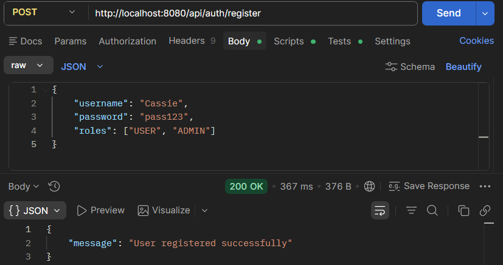
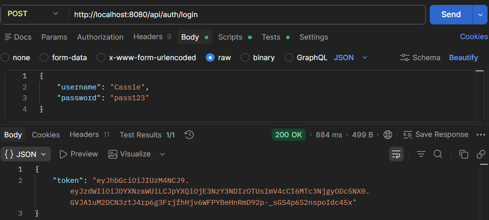
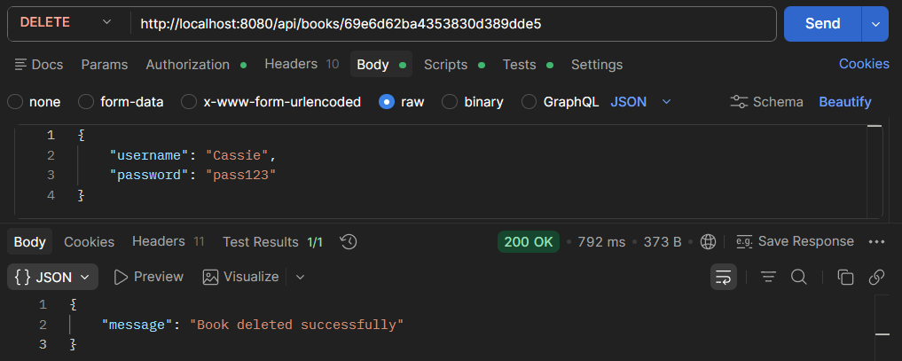
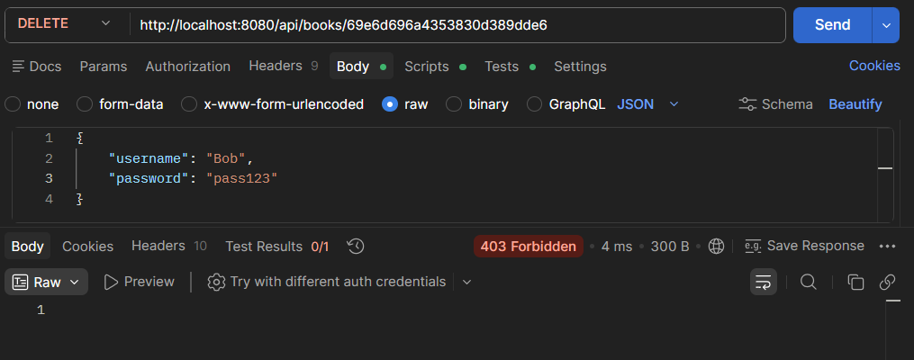

# Assignment 2: JWT Role-Based Authorization

### Added:
* DELETE /api/books/{id}
* Role-based authorization, requires ADMIN role for DELETE operation

---
## Screenshots
### Register new admin:

### Admin Login:

### Admin delete a book by id:

### User delete a book by id:

